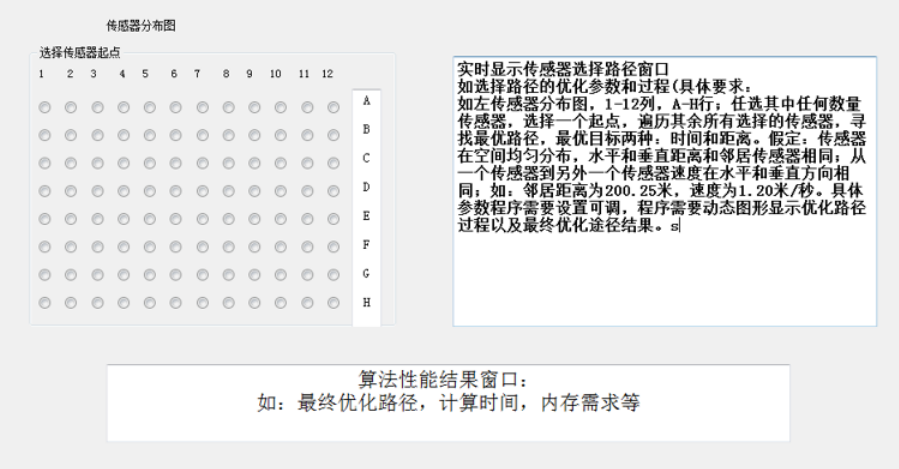

《物联网应用概论》期中项目。
项目提交材料: 

1. 源码和可执行文件: 

2. 简单设计实现文档: 包括开发环境，算法描述等: 

3. 所有项目文件压缩成一一个文件， 文件命名方式:学号姓名项目名称.rar，其中是下划线: 

4. 每个学生独立完成。

期中项且考核满分100分
主要包括:。
源码30%;
可执行文件40%;。
设计文档: 10%; 。
软件设计功能性能要求: 20%; 

《物联网应用基础IoT项目1》
具体要求:
如下面传感器分布图，1-12列， A-i行; 任选其中任何数量传感器，选择-个起点，遍历其余所有选择的传感器，寻找
最优路径，最优目标两种:时间和距离。假定:传感器在空间均匀分布，水平和垂直距离和邻居传感器相同;从-一个传
感器到另外一个传感器速度在水平和垂直方向相同;如:邻居距离为200.25米，速度为1.20米/秒。具体参数程序需要设置可调。
1. 每个学生必须独立完成和展示，下图是建议的GUI界面，可以自己设计GUI,但必须完成下图窗口的主要指标;
2. 建议在C++平台完成开发;
3. 项目完成时间: 2021年11月24日

